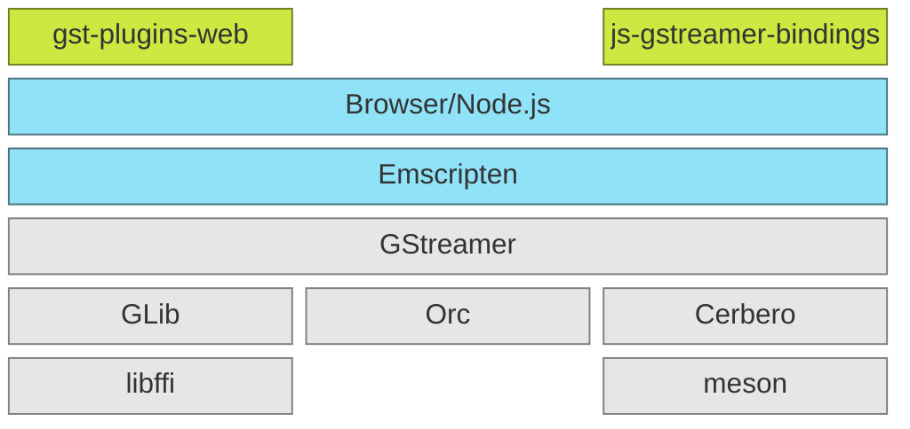

<p align="center">
  
</p>

`gst.wasm` is a **GStreamer port to WebAssembly**. Its main goal is to implement the support of WebAssembly
in GStreamer (and its dependencies) and bring the changes upstream. This repository is a placeholder to
keep up-to-date information required on how to build, develop, and deploy GStreamer in a browser or in
a `node.js` runtime environment until all the information is finally merged into the corresponding
projects.

## The stack
We use the standard libraries and tools used on GStreamer. The gray boxes are the dependencies and the
green ones are new projects that will become part of mainstream GStreamer.



## Dependencies
GStreamer has plenty of dependencies, especially at the plugin level, but our goal is focused on the
core ones, as shown in the gray boxes of the [above diagram](#the-stack). All dependencies use the
[git-upstream-workflow](https://github.com/fluendo/git-upstream-workflow ) meaning that all branches
will be committed upstream and all features are cumulative.

### GLib
We use the fork at [Fluendo](https://github.com/fluendo/glib) in the [gst.wasm](https://github.com/fluendo/glib/tree/gst.wasm) branch.

We forked the excellent work done by [kleisauke](https://github.com/kleisauke/glib) which is also a fork of [GNOME](https://github.com/GNOME/glib).

The [current status](https://github.com/GNOME/glib/compare/2.76.0...fluendo:gst.wasm) is grouped in the next cumulative branches:
<!-- START guw glib.toml markdown -->
* ⏳ `wasm-2.76.0-revert-gregex` [(Branch link)](https://github.com/fluendo/glib/tree/wasm-2.76.0-revert-gregex)
* ⏳ `wasm-2.76.0-no-g_error` [(Branch link)](https://github.com/fluendo/glib/tree/wasm-2.76.0-no-g_error)
* ⏳ `wasm-2.76.0-function-pointer` [(Branch link)](https://github.com/fluendo/glib/tree/wasm-2.76.0-function-pointer)
* ⏳ `wasm-2.76.0-wasm-vs-emscripten` [(Branch link)](https://github.com/fluendo/glib/tree/wasm-2.76.0-wasm-vs-emscripten)
* ⏳ `wasm-2.76.0-canvas-in-thread` [(Branch link)](https://github.com/fluendo/glib/tree/wasm-2.76.0-canvas-in-thread)
* ⏳ `wasm-2.76.0-main-loop-support` [(Branch link)](https://github.com/fluendo/glib/tree/wasm-2.76.0-main-loop-support)
* ⏳ `wasm-2.76.0-garray-fixes` [(Branch link)](https://github.com/fluendo/glib/tree/wasm-2.76.0-garray-fixes)
<!-- END guw glib.toml markdown -->


### GStreamer
We use the fork at [Fluendo](https://github.com/fluendo/gstreamer) in the [gst.wasm](https://github.com/fluendo/gstreamer/tree/wasm-1.22) branch.

The [current status](https://github.com/fluendo/gstreamer/compare/main...fluendo:gst.wasm) is grouped in the next cumulative branches:
<!-- START guw gstreamer.toml markdown -->
* 🟢 `meson_fix_nls`: Use nls option to set ENABLE_NLS [(PR link)](https://gitlab.freedesktop.org/gstreamer/gstreamer/-/merge_requests/7017)
* ⏳ `wasm-main-function-pointer`: Fix null function or function signature mismatch runtime errors [(Branch link)](https://github.com/fluendo/gstreamer/tree/wasm-main-function-pointer)
* ⏳ `wasm-main-enable`: Enable support for wasm [(Branch link)](https://github.com/fluendo/gstreamer/tree/wasm-main-enable)
* ⏳ `wasm-main-test`: Enable unit tests for wasm [(Branch link)](https://github.com/fluendo/gstreamer/tree/wasm-main-test)
* ⏳ `wasm-main-openal`: Add emscripten support OpenAL to play audio [(Branch link)](https://github.com/fluendo/gstreamer/tree/wasm-main-openal)
* ⏳ `wasm-main-gl-support`: Add emscripten OpenGL backend [(Branch link)](https://github.com/fluendo/gstreamer/tree/wasm-main-gl-support)
* ⏳ `wasm-main-videodec` [(Branch link)](https://github.com/fluendo/gstreamer/tree/wasm-main-videodec)
* ⏳ `wasm-main-webtransport` [(Branch link)](https://github.com/fluendo/gstreamer/tree/wasm-main-webtransport)
* ⏳ `wasm-main-wip`: Commits in progress [(Branch link)](https://github.com/fluendo/gstreamer/tree/wasm-main-wip)
* ⏳ `libav-add-element-groups`: Add element_groups meson option to gst-libav [(PR link)](https://gitlab.freedesktop.org/gstreamer/gstreamer/-/merge_requests/8877)
<!-- END guw gstreamer.toml markdown -->

### Cerbero
We use the fork at [Fluendo](https://github.com/fluendo/cerbero) in the [gst.wasm](https://github.com/fluendo/cerbero/tree/gst.wasm) branch.

The [current status](https://github.com/fluendo/cerbero/compare/main...fluendo:cerbero:gst.wasm) is grouped in the next cumulative branches:
<!-- START guw cerbero.toml markdown -->
* 🟢 `tests`: Bring back tests [(PR link)](https://gitlab.freedesktop.org/gstreamer/cerbero/-/merge_requests/1471)
* 🟢 `tests2`: Update more tests. Second round [(PR link)](https://gitlab.freedesktop.org/gstreamer/cerbero/-/merge_requests/1477)
* 🔄 `tests3`: Tests update final round [(PR link)](https://gitlab.freedesktop.org/gstreamer/cerbero/-/merge_requests/1482)
* ⏳ `local_source`: New type of source that allows you to build a recipe without fetching or copying sources [(PR link)](https://gitlab.freedesktop.org/gstreamer/cerbero/-/merge_requests/1483)
* ⏳ `packaging`: Enable installation using pip with a git-https repository [(PR link)](https://gitlab.freedesktop.org/gstreamer/cerbero/-/merge_requests/1484)
* ⏳ `emscripten`: Add support for building for wasm target with emscripten toolchain [(Branch link)](https://github.com/fluendo/cerbero/tree/emscripten)
* ⏳ `emscripten-gl`: Add OpenGL support in gst-plugins-base through new Emscripten based WebGL backend [(Branch link)](https://github.com/fluendo/cerbero/tree/emscripten-gl)
<!-- END guw cerbero.toml markdown -->


## Usage

### Samples
We keep on sync all the samples found at [samples](gst.wasm/subprojects/samples) into a [public website](https://fluendo.github.io/gst.wasm/) to test them easily from any browser.


#### Prepare environment

To build an environment, you can use [steps from CI](.github/workflows/build.yaml):

```
poetry install
git config --global protocol.file.allow always
poetry run cerbero -c build/gst.wasm.cbc bootstrap
poetry run cerbero -c build/gst.wasm.cbc build gst.wasm
```

As a result, in the local directory `build/gst.wasm_web_wasm32/dist/web_wasm32`
you've got all the needed packages with corresponding `*.pc` files, which could be used
to build your project based on the WASM version of GStreamer and its dependencies:

```
$ ls build/gst.wasm_web_wasm32/dist/web_wasm32
bin  include  lib  share
```

#### Compile samples

```
cd gst.wasm
meson --cross-file=emscripten-crossfile.meson _builddir
```

#### Running the samples

First, you'll need to install Emscripten tools from https://emscripten.org/docs/getting_started/downloads.html
Then you can run the samples by doing:

First, you'll need to install Emscripten tools from https://emscripten.org/docs/getting_started/downloads.html
Then you can run the samples by doing:

```
emrun _builddir/subprojects/samples/videotestsrc/videotestsrc-example.html
emrun _builddir/subprojects/samples/openal/openal-example.html # Click to hear to a sound.
```

## Development

Refer to the [Development guide ](DEVELOPMENT.md)

### Coding style

Refer to the [Coding Style guide ](CONTRIBUTING.md)

## Resources
* Blog post [GstWASM: GStreamer for the web](https://fluendo.com/en/blog/gstwasm-gstreamer-for-the-web/)
* GstConf2023 presentation [GstWASM: Gstreamer for the web](https://gstconf.ubicast.tv/videos/gstwasm-gstreamer-for-the-web/)
* GstConf2024 presentation [Gst.WASM Launched](https://gstconf.ubicast.tv/videos/gstwasm-launched/)

## Aknowledgements
* Special thanks to [Fluendo](https://fluendo.com) for promoting and funding this project
* To [@kleisauke](https://github.com/kleisauke) for doing the first libffi/GLib to WASM port
