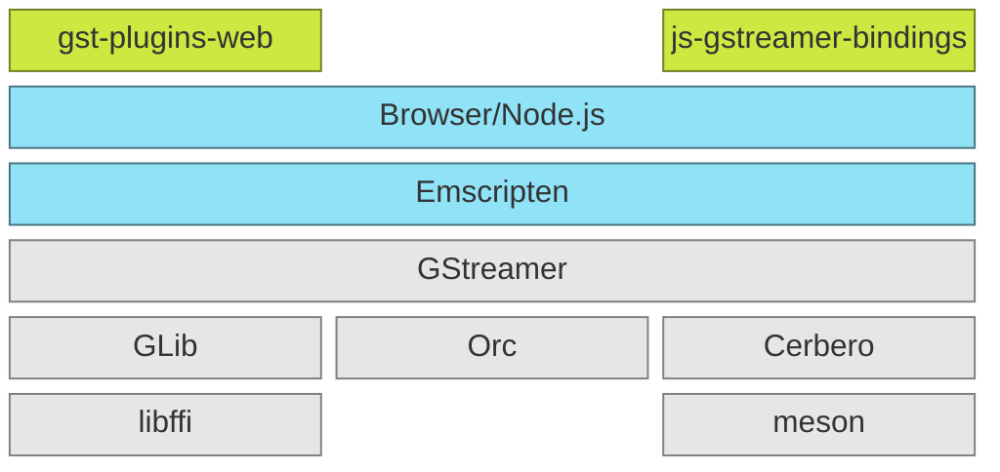

  

___

`gst.wasm` is a GStreamer port to WebAssembly. Its main goal is to implement the support of WebAssembly
in GStreamer (and its dependencies) and bring the changes upstream. This repository is a placeholder to
keep up-to-date information required on how to build, develop, and deploy GStreamer in a browser or in
a `node.js` runtime environment until all the information is finally merged into the corresponding
projects.

## The stack
We use the standard libraries and tools used on GStreamer. The gray boxes are the dependencies and the
green ones are new projects that will become part of mainstream GStreamer.

## Dependencies
GStreamer has plenty of dependencies, especially at the plugin level, but our goal is focused on the
core ones, as shown in the gray boxes of the [above diagram](#the-stack)

### libffi
### GLib
### GStreamer
### Cerbero

## Usage

## Development
